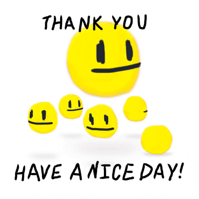

<h1 align="center">Hi, I'm Yusuf</h1>
<h3 align="center">I'm a Fullstack Web Developer</h3>

- 🌱 I’m learning whatever i find (I'm a bit everything :D)

- ⚡ Hobbies: drawing and learning new things

- 🤯🤯I love GO🤯🤯

- 🔍 Currently working on llms & microservices

<h2>🌐 Connect with me:</h2>

&nbsp;&nbsp;

&nbsp;&nbsp;

### 💻 Languages and Tools:

#### Frontend Development

    
    
    
    
    
    
    
    
    
    
    

#### Backend Development

    
    
     
    
    
    
    

#### Database

    
    
    
    

#### DevOps and Cloud

    
    
    
    

#### Monitoring

    
    
    

#### Tools

    
    
    
    
    
    
    
    
    

#### Others

    
    
    
    
     

 
 

---

  
⚡ GitHub Stats

---

